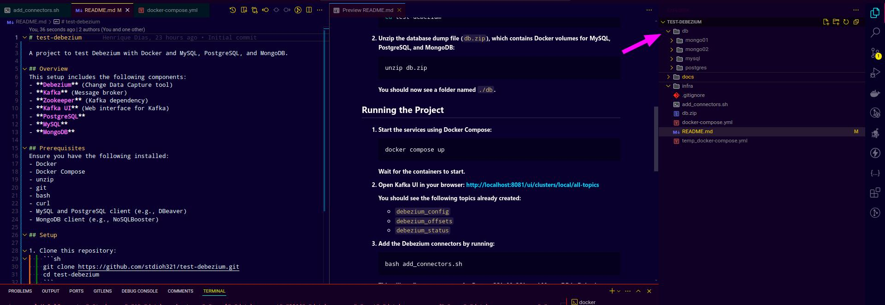
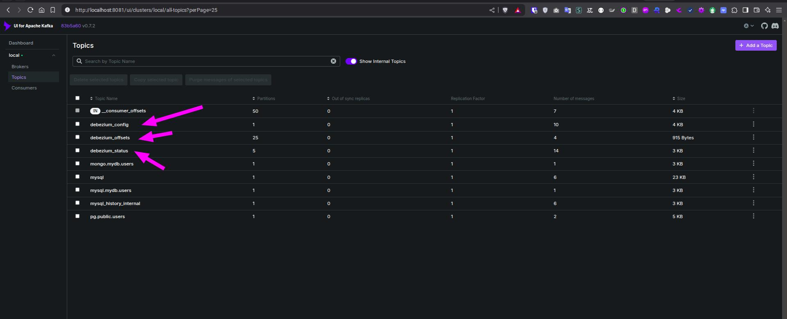
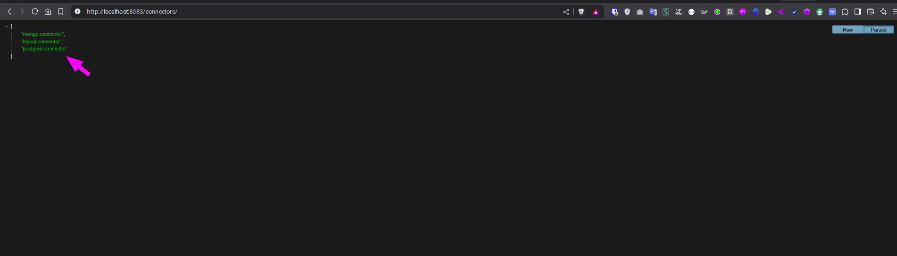
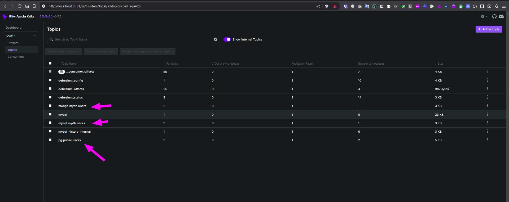

# test-debezium

A project to test Debezium with Docker and MySQL, PostgreSQL, and MongoDB.

## Overview
This setup includes the following components:
- **Debezium** (Change Data Capture tool)
- **Kafka** (Message broker)
- **Zookeeper** (Kafka dependency)
- **Kafka UI** (Web interface for Kafka)
- **PostgreSQL**
- **MySQL**
- **MongoDB**

## Prerequisites
Ensure you have the following installed:
- Docker
- Docker Compose
- unzip
- git
- bash
- curl
- MySQL and PostgreSQL client (e.g., DBeaver)
- MongoDB client (e.g., NoSQLBooster)

## Setup

1. Clone this repository:
    ```sh
    git clone https://github.com/stdioh321/test-debezium.git
    cd test-debezium
    ```

2. Unzip the database dump file (`db.zip`), which contains Docker volumes for MySQL, PostgreSQL, and MongoDB:
    ```sh
    unzip db.zip
    ```
    You should now see a folder named `./db`.
    

## Running the Project

1. Start the services using Docker Compose:
    ```sh
    docker compose up
    ```
    Wait for the containers to start.

2. Open **Kafka UI** in your browser:
    [http://localhost:8081/ui/clusters/local/all-topics](http://localhost:8081/ui/clusters/local/all-topics)

    You should see the following topics already created:
    - `debezium_config`
    - `debezium_offsets`
    - `debezium_status`

3. Add the Debezium connectors by running:
    ```sh
    bash add_connectors.sh
    ```
    This will configure connectors for PostgreSQL, MySQL, and MongoDB in Debezium.

    Verify that the connectors have been added by checking:
    [http://localhost:8083/connectors/](http://localhost:8083/connectors/)

    

4. Using database clients, connect to MySQL, PostgreSQL, and MongoDB, then insert or update records in the `users` table:
    - Every database contains a `users` table.
    - **Database Credentials:**
      - **MySQL:** `root:pass`
      - **PostgreSQL:** `user:pass`
      - **MongoDB:** `user:pass`

5. Monitor the Kafka topics in Kafka UI:
    - `pg.public.users`: PostgreSQL changes in the `users` table
    - `mysql.mydb.users`: MySQL changes in the `users` table
    - `mongo.mydb.users`: MongoDB changes in the `users` collection


      - Inside the messages there is a JSON containing the changes to the item on the database, if created, updated or deleted.

